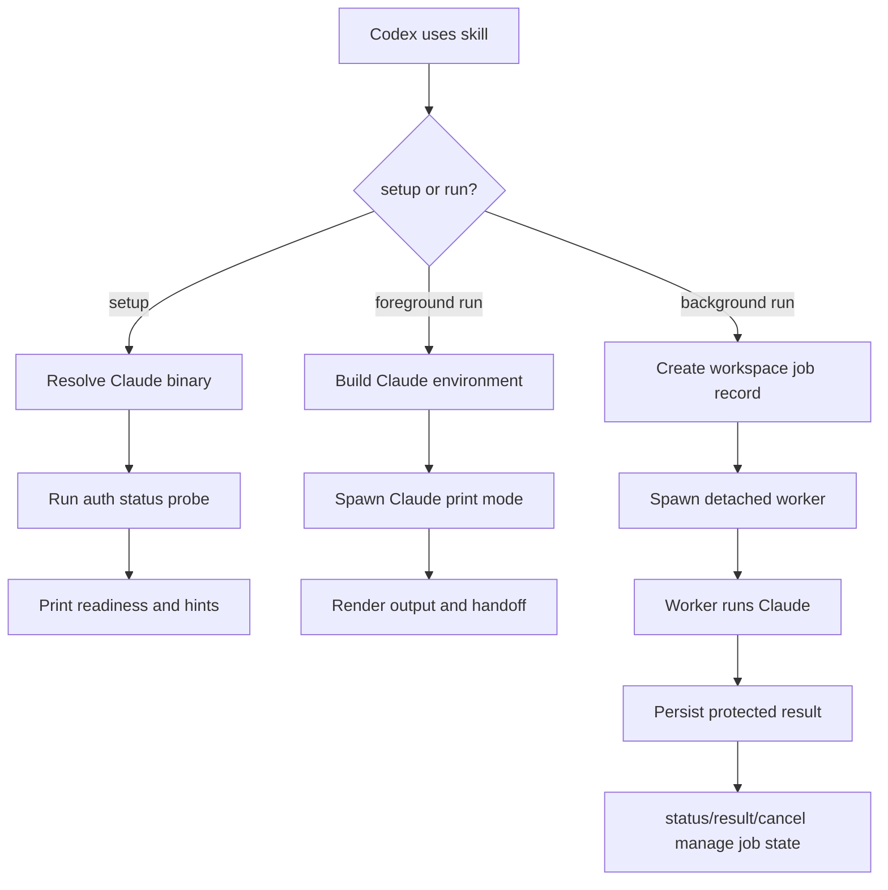

# feat: Add Claude from Codex skill

## Summary

Build a portable Codex skill that delegates work to the user's local Claude Code CLI for parallel investigation, review, or bounded implementation. The v1 deliverable is Skill-only: it ships with deterministic scripts and tests, but no Codex plugin wrapper.

---

## Problem Frame

The user wants Codex to call Claude Code as a general parallel worker, not only as a "second opinion" reviewer. In v1, "general worker" means Codex can send an explicit task prompt plus the relevant file paths, constraints, and acceptance criteria to Claude; v1 does not automatically sync the full Codex transcript or infer hidden context. Claude authentication and provider routing are already configured outside this repo, including cc-switch-style user settings; this project should respect that setup instead of trying to manage it.

Earlier probes showed two environment hazards the plan must account for: Codex-launched subprocesses may not inherit the terminal PATH, and Claude `--bare` / `CLAUDE_CODE_SIMPLE` can bypass user-level settings. The implementation should therefore make setup differences observable without editing the user's Claude configuration.

---

## Requirements

### Core Delegation

- R1. The skill lets Codex delegate a prompt to the local Claude Code CLI and return Claude's final output.
- R2. The skill supports foreground runs for immediate answers and background runs for parallel work.
- R3. Background runs expose status, result, and cancellation commands scoped to the current workspace.
- R4. Delegation supports both read-only and write-capable modes, with read-only as the default.
- R5. Codex must pass explicit task context to Claude and reconcile Claude's output before acting; the skill does not promise automatic full-session context transfer in v1.
- R6. Write-capable delegation reports mode, exit status, changed files, and a visible reminder that Codex must inspect the workspace diff before treating Claude's work as integrated.

### Setup and Environment

- R7. The setup check reports whether Claude is discoverable, which binary path will be used, and whether user-level Claude auth is visible.
- R8. The tool does not modify `~/.claude/settings.json`, tokens, cc-switch configuration, or provider settings.
- R9. The Claude child process avoids `--bare` and removes `CLAUDE_CODE_SIMPLE` so user-level settings remain available.
- R10. The binary resolver prefers an explicit `CLAUDE_BIN`, then the common user-local Claude path, then PATH lookup.
- R11. The setup check defines "auth visible" as a non-generative Claude auth-status probe that loads user settings, returns readiness, and never prints token values.
- R12. The Claude child environment uses a minimal allowlist rather than inheriting arbitrary Codex secrets.
- R13. The binary resolver validates the selected Claude executable before running it and invokes it without a shell.

### Background State and Safety

- R14. Background job state is stored outside the repo under an owner-only per-workspace state root with atomic writes and symlink-safe path handling.
- R15. Job records include enough process identity to cancel a detached worker, detect stale jobs, and avoid overwriting terminal states after races.
- R16. Persisted job status and error summaries redact common secret patterns, and the tool provides a documented retention or clear/prune path.

### Packaging and Reviewability

- R17. The v1 artifact remains installable as a plain Codex skill folder without requiring Codex plugin marketplace login.
- R18. The repo includes deterministic tests for argument parsing, environment construction, setup checks, run-mode command assembly, job state, and skill metadata validation.
- R19. User-facing documentation explains that Claude setup is external and that failed setup checks should be fixed outside Codex.
- R20. Documentation and validation cover the plain Skill-only activation path, including how Codex discovers the installed skill and invokes setup through it.

---

## Key Technical Decisions

- KTD1. Skill-only is the core distribution shape: a plugin wrapper adds install UX but also introduces account and marketplace constraints, so v1 keeps the reusable capability in `skills/claude-from-codex/`.
- KTD2. Use a no-dependency Node companion script: the user's project rules prefer `pnpm` for JS tooling, and Node's process APIs are enough for CLI dispatch and background jobs.
- KTD3. Default to read-only delegation: this lets Codex safely ask Claude for investigation or review while reserving write-capable work for explicit user intent.
- KTD4. Store job state per workspace: status/result/cancel need durable state, but it should not live inside the repository or pollute commits.
- KTD5. Treat setup as diagnostics, not provisioning: the script reports concrete hints but does not install Claude, log in, or rewrite settings.
- KTD6. Keep the optional plugin wrapper out of v1: the plan should not create `.codex-plugin/plugin.json` or marketplace entries until the skill-only path is proven useful.
- KTD7. Pin the current Claude CLI contract in tests: foreground runs use print mode (`claude -p`) with structured output, normal user settings, no `--bare`, no dangerous permission bypass, and an explicit read-only vs write-capable permission policy.
- KTD8. Prefer tested local contracts over copied code: use `codex-plugin-cc` as a reference for companion-script posture and job lifecycle concepts, but inline the smaller state and command contracts this skill needs so the implementation does not depend on that repo being present.
- KTD9. Declare compatibility floors: v1 targets the current tested Claude Code CLI contract, Node LTS or newer for the no-dependency script, and `pnpm` for validation scripts; package metadata should pin `packageManager` and `engines`.

---

## High-Level Technical Design



The skill body tells Codex when to use the capability and how to choose foreground, background, read-only, or write-capable delegation. The companion script owns deterministic work: binary discovery, environment construction, Claude invocation, job persistence, and rendering. Tests pin these contracts so future agents can review behavior without manually re-running every Claude path.

---

## Command and State Contracts

### Claude CLI Contract

- **Resolver:** `CLAUDE_BIN` must be an absolute executable path when set. The resolver canonicalizes and displays the real path, refuses workspace-relative or world-writable executables unless an explicit override is added later, checks the common user-local path before PATH lookup, and always spawns without a shell.
- **Setup auth probe:** Setup runs the resolved Claude binary with normal user settings and the non-generative auth-status command, equivalent to `claude --setting-sources user,project,local auth status --json`. Ready means the JSON reports `loggedIn: true`. Human and JSON output may include readiness, binary path, auth method, and provider, but never token values or raw settings contents.
- **Foreground read-only command:** The default `run` path uses Claude print mode with structured output, normal user settings, no `--bare`, no `CLAUDE_CODE_SIMPLE`, and no dangerous permission bypass. The initial command contract is `claude -p --output-format json --permission-mode plan --setting-sources user,project,local` plus an explicit deny list for file mutation tools such as `Edit`, `MultiEdit`, and `Write`. The prompt should be passed through stdin or another non-shell path so shell quoting and process-list exposure are minimized.
- **Write-capable command:** `--write` is allowed only when the current user turn explicitly asks for write-capable delegation. It runs in the intended workspace cwd, uses normal Claude permission handling, does not pass dangerous permission-bypass flags, records requested write scope in the result/job record, and preserves Claude permission prompts rather than auto-approving destructive actions.
- **Drift check:** Unit tests use a fake Claude executable for deterministic behavior. An optional opt-in live smoke check can run setup and a no-op print-mode prompt against the installed Claude CLI to catch flag drift before relying on the fake tests; document that the print-mode smoke can spend Claude tokens.

### Child Environment Contract

The child process starts from a minimal allowlist: `HOME`, `USER`, `LOGNAME`, `SHELL`, `TERM`, `TMPDIR`, `LANG`, `LC_*`, and the constructed PATH needed to find Claude and basic system tools. It removes `CLAUDE_CODE_SIMPLE` and common unrelated secret variables such as `OPENAI_API_KEY`, `GITHUB_TOKEN`, `AWS_SECRET_ACCESS_KEY`, and cloud-provider tokens by default. Claude provider credentials should come from the user's Claude settings flow; if a future deployment needs extra environment pass-through, that should be an explicit allowlist, not full inheritance.

### Background Job State Contract

- **State root:** Store jobs under `${XDG_STATE_HOME:-~/.local/state}/claude-from-codex/<workspace-key>/jobs/`, where `<workspace-key>` is a stable hash of the canonical workspace root plus a readable basename for diagnostics. Tests use an environment override for the state root.
- **File safety:** Create state directories with owner-only permissions, write job files owner-only, reject symlink traversal, and update JSON records via temp-file plus atomic rename.
- **Job record:** Persist `id`, `workspaceRoot`, `mode`, `requestedWriteScope`, `status`, `createdAt`, `updatedAt`, `startedAt`, `finishedAt`, `pid`, `pgid`, `exitCode`, `signal`, `promptPreview`, `outputPath`, `errorSummary`, and `changedFiles` when available. `status` values are `queued`, `running`, `completed`, `failed`, `cancelRequested`, `cancelled`, and `stale`.
- **Sensitive data:** Status and error summaries redact common secret patterns. Full prompts and outputs are treated as sensitive local state: store only what the worker needs, keep it owner-only, and document that `result` intentionally reveals the stored Claude output to the local user.
- **Cancellation and stale jobs:** `cancel` stores a terminal or cancel-requested state and sends a termination signal to the stored process group when it is still alive. Workers must not overwrite terminal `cancelled` or `failed` states with late success. `status` detects stale jobs by PID liveness and a documented heartbeat or update-age threshold.
- **Retention:** Provide a documented cleanup path, such as `prune --older-than <duration>` or `clear`, so sensitive job records are not retained indefinitely.

---

## Output Structure

```text
skills/
  claude-from-codex/
    SKILL.md
    agents/
      openai.yaml
    scripts/
      claude-companion.mjs
package.json
tests/
  claude-companion.test.mjs
README.md
```

This tree is the expected v1 shape. If implementation reveals that the script should be split into small library modules, keep those modules under `skills/claude-from-codex/scripts/` so the skill remains portable as a folder.

---

## Implementation Units

### U1. Replace the Skill Template

- **Goal:** Turn the generated placeholder skill into concise operating guidance for delegating work from Codex to Claude.
- **Requirements:** R1, R2, R4, R5, R6, R8, R17, R19, R20
- **Dependencies:** None
- **Files:** `skills/claude-from-codex/SKILL.md`, `skills/claude-from-codex/agents/openai.yaml`
- **Approach:** Describe the skill as a general Claude delegation capability, not a review-only tool. Document setup boundaries, foreground/background usage, read-only default, explicit write mode, required explicit context in prompts, and how Codex should reconcile Claude output before acting on it.
- **Patterns to follow:** Use the existing skill-creator template structure but remove all TODO guidance. Keep `agents/openai.yaml` aligned with the final skill description.
- **Test scenarios:**
  - Validate that the skill frontmatter has the final name and a trigger description covering Claude Code delegation, parallel runs, review, investigation, and implementation slices.
  - Validate that no TODO placeholder text remains in `SKILL.md`.
  - Validate that `agents/openai.yaml` contains user-facing metadata consistent with the skill body.
- **Verification:** Skill validation passes and a reviewer can understand when to use the skill without reading the companion script.

### U2. Add the Companion CLI Core

- **Goal:** Provide deterministic `setup` and foreground `run` commands for invoking local Claude Code.
- **Requirements:** R1, R4, R6, R7, R8, R9, R10, R11, R12, R13, R18
- **Dependencies:** U1
- **Files:** `skills/claude-from-codex/scripts/claude-companion.mjs`, `tests/claude-companion.test.mjs`, `package.json`
- **Approach:** Implement argument parsing, Claude binary resolution, child-environment construction, setup diagnostics, and foreground Claude invocation according to the Claude CLI Contract. Prefer explicit binary paths and user-level settings. Strip `CLAUDE_CODE_SIMPLE`, avoid `--bare`, avoid dangerous permission-bypass flags, and pass prompts without shell interpolation.
- **Execution note:** Start with tests for argument parsing and environment construction because those contracts encode the previously observed failure modes.
- **Patterns to follow:** Mirror the thin companion-script posture from `codex-plugin-cc`: deterministic script behavior, structured JSON option for machine-readable output, and concise human rendering.
- **Test scenarios:**
  - Given a prompt and no flags, `run` builds the read-only print-mode Claude invocation from the contract and includes the prompt unchanged.
  - Given `--write`, `run` switches to the write-capable contract, preserves user-level settings, records write mode, and does not pass dangerous permission-bypass flags.
  - Given `CLAUDE_CODE_SIMPLE=1` in the parent environment, the child environment removes it.
  - Given parent secret variables such as `OPENAI_API_KEY`, `GITHUB_TOKEN`, and `AWS_SECRET_ACCESS_KEY`, the child environment does not inherit them by default.
  - Given `CLAUDE_BIN`, binary resolution uses it only when it is an absolute executable path that passes trust checks; otherwise setup reports a concrete warning.
  - Given no usable Claude binary, `setup --json` returns a not-ready report with a setup hint and no token values.
  - Given a usable Claude binary, setup runs the auth-status JSON probe without a model call and redacts raw settings.
  - Optional live smoke check: with an explicit opt-in, setup and a no-op print-mode prompt succeed against the installed Claude CLI, with documentation that the print-mode check can spend tokens.
- **Verification:** CLI core tests pass without requiring a live Claude API call by using exported helpers or a fake executable where needed.

### U3. Add Background Job Management

- **Goal:** Let Codex delegate longer work to Claude and continue working while the job runs.
- **Requirements:** R2, R3, R4, R6, R14, R15, R16, R18
- **Dependencies:** U2
- **Files:** `skills/claude-from-codex/scripts/claude-companion.mjs`, `tests/claude-companion.test.mjs`
- **Approach:** Add background `run`, worker execution, workspace-scoped job records, `status`, `result`, `cancel`, and a documented cleanup path. Store state outside the repo by default, with an environment override for tests and unusual deployments.
- **Technical design:** A background run creates a protected job record before spawning a detached worker. The worker records PID/process-group identity, updates heartbeat or `updatedAt`, writes output through the protected state path, and checks terminal state before writing completion. `cancel` signals the process group when present and records `cancelRequested` or `cancelled` without letting late worker completion overwrite the terminal state.
- **Patterns to follow:** Use the `codex-plugin-cc` job-state pattern as a reference, but keep this implementation smaller because it only needs local Claude process tracking.
- **Test scenarios:**
  - Starting a background run creates a job with a stable ID and running or queued status.
  - Job state is written under the workspace-scoped state root with owner-only permissions and atomic JSON updates.
  - A worker success writes final output, exit metadata, and completed status.
  - A worker failure writes failed status and a visible, redacted error summary.
  - `status` lists jobs newest-first and shows whether each job was read-only or write-capable.
  - `result` returns the most recent finished job when no ID is provided.
  - `cancel` terminates a fake long-running worker process group and does not throw when the process already exited.
  - A worker that finishes after cancellation does not overwrite the terminal cancelled state.
  - `status` reports `stale` for a running job whose process is gone or whose heartbeat exceeds the documented threshold.
  - Cleanup removes old job records without touching repository files.
- **Verification:** Background behavior is testable with a fake Claude executable and a temporary state directory.

### U4. Add Repository Tooling and Validation

- **Goal:** Make the skill easy for future agents and humans to validate.
- **Requirements:** R17, R18, R19, R20
- **Dependencies:** U1, U2, U3
- **Files:** `package.json`, `README.md`, `tests/claude-companion.test.mjs`
- **Approach:** Add `pnpm`-friendly scripts for unit tests and skill validation. Document how to run setup, foreground delegation, background delegation, cleanup, and validation. Include the exact plain Skill-only installation path and a validation step showing Codex can discover the installed skill and invoke setup through it.
- **Patterns to follow:** Keep scripts simple and local. Avoid introducing dependencies unless a test becomes unreasonably hard with Node's standard library.
- **Test scenarios:**
  - `pnpm test` runs all unit tests.
  - `package.json` declares `packageManager` and `engines` consistent with the compatibility floor.
  - Skill validation passes against `skills/claude-from-codex/`.
  - README examples reference the skill-only script path and do not mention plugin marketplace installation as required.
  - Installation docs let a non-author place or symlink `skills/claude-from-codex/` into the Codex skills path, confirm metadata discovery, and run setup from Codex using the skill.
- **Verification:** A fresh checkout can validate the skill and run tests with Node and pnpm.

### U5. Defer Plugin Wrapper and Advanced Session Sync

- **Goal:** Make non-v1 scope explicit so implementation does not expand while building the core skill.
- **Requirements:** R8, R17, R19
- **Dependencies:** U4
- **Files:** `README.md`, `skills/claude-from-codex/SKILL.md`
- **Approach:** Document optional future work in prose only: Codex plugin wrapper, marketplace install flow, richer session resume, automatic context synthesis, and deeper Claude/Codex transcript synchronization. Do not add plugin manifests or marketplace files in v1. Revisit plugin packaging only after a non-author install attempt exposes Skill-only activation friction that README changes cannot remove.
- **Patterns to follow:** Keep follow-up notes short and non-blocking.
- **Test scenarios:** Test expectation: none -- this unit documents scope boundaries and does not add runtime behavior.
- **Verification:** The repo contains no `.codex-plugin/plugin.json` as part of v1, and README states plugin packaging is optional follow-up work.

---

## Acceptance Examples

- AE1. Given Claude is installed at a user-local path and PATH does not include that directory, when setup runs, it still discovers Claude and reports the resolved path.
- AE2. Given user-level Claude settings are valid, when setup checks auth, it reports ready without asking Codex to edit Claude settings.
- AE3. Given a long-running investigation prompt, when Codex starts it in background mode, Codex can later list the job and retrieve the final output.
- AE4. Given the user does not request write mode, when Codex delegates a task, Claude receives a read-only constraint.
- AE5. Given the user explicitly requests write-capable delegation, when Codex delegates the task, the result reports write mode, exit status, changed files, and a diff-inspection reminder.
- AE6. Given a user asks for parallel investigation, when Codex delegates to Claude, the prompt includes the relevant files, constraints, and acceptance criteria instead of assuming Claude has the full Codex transcript.
- AE7. Given Codex has unrelated secret environment variables, when the companion spawns Claude, those variables are not present in the child environment by default.
- AE8. Given a background Claude job is running, when Codex cancels it, the worker process stops or is marked cancel-requested, and late completion cannot overwrite the cancelled state.
- AE9. Given a fresh checkout, when the user follows README installation steps, Codex can discover the plain skill and run its setup check without a plugin marketplace install.

---

## Scope Boundaries

### In Scope

- Skill-only distribution under `skills/claude-from-codex/`.
- A deterministic companion script for local Claude invocation.
- Workspace-scoped background job management.
- Setup diagnostics and hints.
- Explicit-context delegation and result reconciliation guidance.
- Child environment, binary resolver, and job-state safety controls.
- Tests and README coverage for the skill-only workflow.

### Deferred to Follow-Up Work

- Codex plugin manifest and marketplace packaging.
- Claude session resume or thread continuation semantics.
- Rich two-way transcript synchronization between Codex and Claude.
- Automatic prompt synthesis from full Codex context.
- Automatic installation or mutation of Claude, cc-switch, or provider settings.

---

## Risks & Dependencies

- **Claude CLI behavior may change:** Keep setup checks and command assembly covered by tests so failures point at the changed contract.
- **Auth is external:** The tool can diagnose missing user settings through a non-generative auth-status probe, but it must not claim to fix auth or print settings contents.
- **Same-worktree writes can conflict:** Write-capable delegation should be explicit, report changed files, and require Codex to inspect workspace changes before continuing.
- **Background state is sensitive:** Prompts, outputs, and error summaries can contain secrets or private source context, so state must be owner-only, redacted where summarized, and prunable.
- **Background processes can stale:** Status should distinguish running, completed, failed, cancelled, and stale jobs using recorded process identity and heartbeat/update timestamps.
- **Binary resolution is a trust boundary:** `CLAUDE_BIN` and PATH lookup improve portability but must not silently run workspace-relative, shell-expanded, or world-writable executables.
- **Cost controls are not guaranteed:** Earlier live probes showed Claude may report spending above a requested budget, so the skill should not promise hard cost enforcement.
- **Skill-only adoption can fail at activation:** README validation must prove Codex can discover and use the skill; plugin packaging stays deferred unless Skill-only activation friction remains after docs are corrected.

---

## Sources & Research

- `skills/claude-from-codex/SKILL.md` and `skills/claude-from-codex/agents/openai.yaml` are the current generated skill template to replace.
- `https://github.com/openai/codex-plugin-cc` demonstrates the companion-script and job-state pattern for delegating from one coding agent CLI to another; copy only the smaller contracts needed here rather than depending on the external repo at implementation time.
- Local probes confirmed `claude 2.1.160`, `node v25.4.0`, and `pnpm 10.24.0` are available in this environment.
- Local probes confirmed `claude --help` exposes `-p`, `--output-format`, `--permission-mode`, `--allowedTools`, `--disallowedTools`, `--setting-sources`, and `--bare`.
- Local probes confirmed `claude auth status --json` reports `loggedIn`, `authMethod`, and `apiProvider` without a model call.
- Local probes confirmed `--bare` / `CLAUDE_CODE_SIMPLE` can hide user-level Claude auth, while normal user settings mode can see it.
