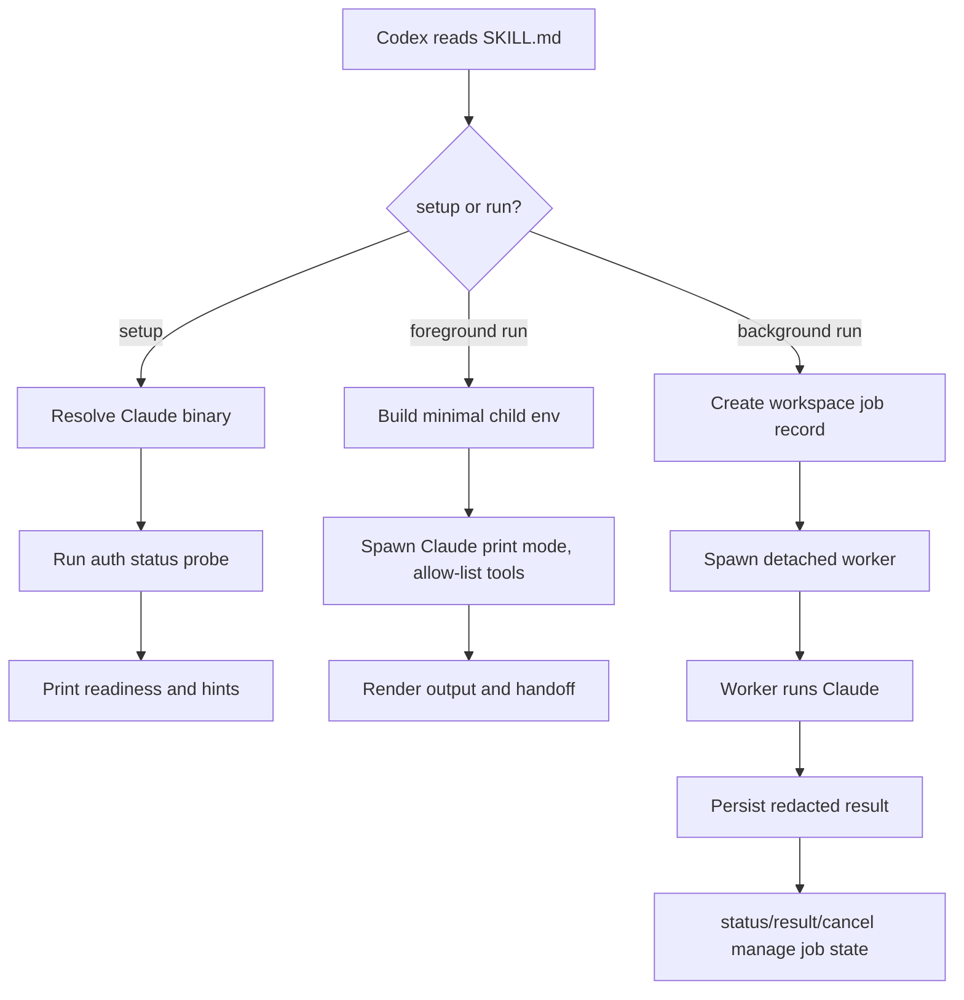

# feat: Add Claude from Codex skill

## Summary

Build a portable Codex skill that delegates work to the user's local Claude Code CLI for parallel investigation, review, or bounded implementation. The v1 deliverable is Skill-only: it ships with deterministic scripts and tests, but no Codex plugin wrapper. Codex invokes the companion script through natural-language guidance in `SKILL.md` (the only activation mechanism the skill model provides), and the script owns all deterministic, testable behavior.

---

## Problem Frame

The user wants Codex to call Claude Code as a general parallel worker, not only as a "second opinion" reviewer. In v1, "general worker" means Codex can send an explicit task prompt plus the relevant file paths, constraints, and acceptance criteria to Claude; v1 does not automatically sync the full Codex transcript or infer hidden context. Claude authentication and provider routing are already configured outside this repo, including cc-switch-style user settings; this project should respect that setup instead of trying to manage it.

Earlier probes showed two environment hazards the plan must account for: Codex-launched subprocesses may not inherit the terminal PATH (Codex does not source shell rc files), and Claude `--bare` / `CLAUDE_CODE_SIMPLE` can bypass user-level settings. The implementation should therefore make setup differences observable without editing the user's Claude configuration. A third hazard surfaced during deepening: macOS has no `setsid`, so detached-worker cancellation must not assume a Linux process-group CLI exists.

---

## Requirements

### Core Delegation

- R1. The skill lets Codex delegate a prompt to the local Claude Code CLI and return Claude's final output.
- R2. The skill supports foreground runs for immediate answers and background runs for parallel work.
- R3. Background runs expose status, result, and cancellation commands scoped to the current workspace.
- R4. Delegation supports both read-biased and write-capable modes, with read-biased as the default. Read-biased relies on Claude's permission policy and an explicit tool allow-list, not a sandbox; it is not a guarantee of zero side effects.
- R5. Codex must pass explicit task context to Claude and reconcile Claude's output before acting; the skill does not promise automatic full-session context transfer in v1.
- R6. Write-capable delegation records the *intended* write scope (advisory, not path-confined), exit status, changed files, and a visible reminder that Codex must inspect the workspace diff — including `.git` internals — before treating Claude's work as integrated.

### Setup and Environment

- R7. The setup check reports whether Claude is discoverable, which binary path will be used, and whether user-level Claude auth is visible.
- R8. The tool does not modify `~/.claude/settings.json`, tokens, cc-switch configuration, or provider settings. (Note: print mode silently skips the workspace-trust dialog and ignores invalid settings files, so respecting user setup means never relying on editing it.)
- R9. The Claude child process avoids `--bare` and removes `CLAUDE_CODE_SIMPLE` so user-level settings remain available.
- R10. The binary resolver prefers an explicit `CLAUDE_BIN`, then the common user-local Claude path, then PATH lookup, and resolves the Node binary used to spawn workers via the same trust-checked resolver.
- R11. The setup check defines "auth visible" as a non-generative Claude auth-status probe that returns readiness, and never prints token values.
- R12. The Claude child environment uses a minimal allowlist rather than inheriting arbitrary Codex secrets. The allowlist prevents environment-variable exfiltration; it does not prevent filesystem access to credential files reachable through `HOME`.
- R13. The binary resolver validates the selected Claude executable before running it, rejects workspace-relative and group-/world-writable executables, revalidates symlink targets, and invokes it without a shell.

### Background State and Safety

- R14. Background job state is stored outside the repo under an owner-only per-workspace state root with atomic, symlink-safe writes.
- R15. Job records include enough process identity (PID plus a start-time / binary-path fingerprint) to cancel a detached worker, detect stale jobs, avoid signaling a PID that has been recycled by an unrelated process, and avoid overwriting terminal states after races.
- R16. Persisted job status, error summaries, and prompt previews redact a defined set of common secret patterns, and the tool provides a documented retention or clear/prune path.

### Packaging and Reviewability

- R17. The v1 artifact remains installable as a plain Codex skill folder without requiring Codex plugin marketplace login.
- R18. The repo includes deterministic tests for argument parsing, environment construction, binary resolution, setup checks, run-mode command assembly, job state, and skill metadata validation.
- R19. User-facing documentation explains that Claude setup is external and that failed setup checks should be fixed outside Codex.
- R20. Documentation and validation cover the plain Skill-only activation path: how Codex discovers the installed skill, and how `SKILL.md` instructs Codex to invoke the companion script through literal, copy-pasteable commands.

---

## Key Technical Decisions

- KTD1. Skill-only is the core distribution shape: a plugin wrapper adds install UX but also introduces account and marketplace constraints, so v1 keeps the reusable capability in `skills/claude-from-codex/`.
- KTD2. Use a no-dependency Node companion script. Node is chosen because (1) the Claude foreground/auth contracts are JSON-shaped and require structured parsing plus a JSON `--output-format`, which Node handles natively without a `jq` dependency; (2) R18 requires zero-dependency contract tests, and Node's built-in test runner plus a fake executable meet this where POSIX shell would force a test framework (bats) and `jq`; (3) the minimal child-environment allowlist (R12) and no-shell Claude invocation (R13) are cleanly expressed and testable in Node. POSIX shell is rejected because JSON handling and env-allowlist testing would force dependencies; Python is rejected because it adds a second runtime without architectural benefit. The `pnpm`/JS preference is a tiebreaker, not the primary rationale.
- KTD3. Default to read-biased delegation: this lets Codex safely ask Claude for investigation or review while reserving write-capable work for explicit user intent. Read-biased is enforced by `--permission-mode plan` (already analyze-only) backed by an explicit tool allow-list as defense-in-depth.
- KTD4. Store job state per workspace: status/result/cancel need durable state, but it should not live inside the repository or pollute commits.
- KTD5. Treat setup as diagnostics, not provisioning: the script reports concrete hints but does not install Claude, log in, or rewrite settings.
- KTD6. Keep the optional plugin wrapper out of v1: the plan should not create `.codex-plugin/plugin.json` or marketplace entries until the skill-only path is proven useful.
- KTD7. Pin the current Claude CLI contract in tests: foreground runs use print mode (`claude -p`) with structured output, normal user settings, no `--bare`, no dangerous permission bypass, and an explicit read-biased vs write-capable permission policy.
- KTD8. Prefer tested local contracts over copied code: use `codex-plugin-cc` and the local `gstack-claude` skill as references for companion-script posture and job lifecycle concepts, but inline the smaller state and command contracts this skill needs so the implementation does not depend on those repos being present.
- KTD9. Declare compatibility floors: v1 targets the current tested Claude Code CLI contract, Node LTS or newer for the no-dependency script, `pnpm` for validation scripts, and macOS/Linux for background jobs (foreground `run` is cross-platform). Package metadata should pin `packageManager` and `engines`.
- KTD10. Invocation contract: Codex runs the companion script through natural-language instruction in `SKILL.md` — the skill model provides no declared entry-point or command field, only `name` and `description` frontmatter. `SKILL.md` is guidance-only (what/when); the companion script is behavior-only (how). The script must remain callable as `node <skill>/scripts/claude-companion.mjs <command> [--json]` with a stable subcommand surface, so `SKILL.md` prose stays stable as script internals evolve. Activation is explicit (`$claude-from-codex`) or implicit (description match); `agents/openai.yaml` is optional UI/policy metadata only.

---

## High-Level Technical Design



The skill body tells Codex when to use the capability and how to choose foreground, background, read-biased, or write-capable delegation, and contains the literal invocation commands Codex must run. The companion script owns deterministic work: binary discovery, environment construction, Claude invocation, job persistence, and rendering. The single contract crossing the skill/script seam is `<command-and-flags> → JSON-or-human result`. Tests pin these contracts so future agents can review behavior without manually re-running every Claude path.

---

## Command and State Contracts

### Skill Discovery, Activation & Invocation Contract

- **Discovery:** A skill is a folder containing a `SKILL.md` with required frontmatter fields `name` and `description`. There is no entry-point, command, or `bin` field in the manifest. Codex reads `SKILL.md` into context to decide whether and how to act.
- **Install scopes (documented):** Canonical install targets are the USER scope `$HOME/.agents/skills/claude-from-codex/` (works across all repos for one user) or the REPO scope `$REPO_ROOT/.agents/skills/claude-from-codex/` (checked into a repo). These are the scopes in the official Codex skills documentation. The `~/.codex/skills` location also works today (codex 0.140.0) and is what bundled skill-installer tooling writes to, but it is **not** in the documented scopes table and is a doc-vs-behavior drift risk; prefer `$HOME/.agents/skills`.
- **Activation:** Explicit via `$claude-from-codex`, or implicit when the description matches. `agents/openai.yaml` holds optional UI/policy fields (`display_name`, `short_description`, `default_prompt`, optional `policy.allow_implicit_invocation` defaulting to `true`); it is not required for discovery and declares no runnable entry point.
- **Invocation:** `SKILL.md` instructs Codex to run the companion script by a path resolved relative to the installed skill location (the script resolves its own location rather than assuming a cwd, so it works whether run from the repo or the installed skills path). The stable command surface:
  - Setup: `node <skill>/scripts/claude-companion.mjs setup [--json]`
  - Foreground: `node <skill>/scripts/claude-companion.mjs run [--readonly|--write] [--json]` with the prompt on **stdin**
  - Background: `... run --background [--write] [--json]` (prompt on stdin), then `... status [id] [--json]`, `... result [id] [--json]`, `... cancel [id] [--json]`, `... prune --older-than <duration>`
  - `--write` is passed only when the user's current turn explicitly requests write-capable delegation.
- **Boundary integrity (advisory):** Codex is a general agent with shell access, so it could in principle invoke `claude` directly and bypass the read-biased default, env allowlist, and binary trust checks. v1 mitigates this only through clear `SKILL.md` guidance and structured `--json` results that make the blessed path more useful than the bypass; enforced sandboxing is deferred with the plugin wrapper (U5).

### Claude CLI Contract

- **Resolver:** `CLAUDE_BIN` must be an absolute executable path when set. The resolver canonicalizes and displays the real path; refuses any executable that is workspace-relative or whose mode is group-writable or world-writable; resolves symlinks via `realpath` and revalidates the target **and each ancestor directory** in the chain (none group-/world-writable, none a symlink whose target falls outside an allowlist of trusted roots such as `/usr/local/bin`, `/opt/homebrew/bin`, `/usr/bin`, `/bin`, `~/.local/bin`); prefers the common user-local path before PATH lookup; and always spawns without a shell. A validate→exec TOCTOU window remains as residual risk, accepted only because the ancestor-directory check makes the path non-attacker-writable. The same resolver also locates the Node binary used to spawn workers (prefer `process.execPath`, which is already a known-good Node).
- **Setup auth probe:** Setup runs the resolved Claude binary with normal user settings and the non-generative auth-status command `claude --setting-sources user,project,local auth status --json`, which returns `loggedIn`, `authMethod`, and `apiProvider` with exit 0 and no model call. Ready means `loggedIn: true`. Human and JSON output may include readiness, binary path, auth method, and provider, but never token values or raw settings contents.
- **Foreground read-biased command:** The default `run` path uses Claude print mode with structured output, normal user settings, no `--bare`, no `CLAUDE_CODE_SIMPLE`, and no dangerous permission bypass. Read-biased is enforced primarily by `--permission-mode plan` (already analyze-only); as defense-in-depth, prefer an explicit allow-list via `--allowedTools Read,Grep,Glob` (strictly safer than a deny-list because it survives newly added Claude tools). If a deny-list is used instead, it must include `Bash` (still available in plan mode) and use current tool names `Edit,Write,Bash` — not `MultiEdit`, which may not be a live tool name. Add `--disable-slash-commands` so the delegated Claude does not recurse into its own skills. Optionally offer `--max-budget-usd` (best-effort cost cap) and `--no-session-persistence` for ephemeral foreground runs. The prompt is passed through stdin so it is not exposed in process listings.
- **Write-capable command:** `--write` is allowed only when the current user turn explicitly asks for write-capable delegation. It runs in the intended workspace cwd, uses normal Claude permission handling, does not pass dangerous permission-bypass flags, records the *intended* write scope in the result/job record (advisory — Claude is not path-confined to it), and preserves Claude permission prompts rather than auto-approving destructive actions.
- **Workspace-trust caveat:** Because the companion always runs in `-p` mode, Claude silently skips the workspace-trust dialog and ignores invalid settings files. This reinforces R8: never rely on editing user settings; treat user/`project`/`local` settings as present-but-untrusted.
- **Drift check:** Unit tests use a fake Claude executable for deterministic behavior. An optional opt-in live smoke check can run setup and a no-op print-mode prompt against the installed Claude CLI to catch flag drift; document that the print-mode smoke can spend Claude tokens.

### Child Environment Contract

The child process starts from a minimal allowlist: `HOME`, `USER`, `LOGNAME`, `SHELL`, `TERM`, `TMPDIR`, `LANG`, `LC_*`, and a constructed PATH. It removes `CLAUDE_CODE_SIMPLE` and common unrelated secret variables (`OPENAI_API_KEY`, `GITHUB_TOKEN`, `AWS_SECRET_ACCESS_KEY`, and cloud-provider tokens) by default.

- **Necessary HOME exposure (disclosed):** `HOME` is allowed because Claude needs it, but it transitively exposes credential files on disk (`~/.aws/credentials`, `~/.config/gcloud`, `~/.npmrc`, `~/.netrc`, `~/.gitconfig`, `~/.ssh`, `~/.docker/config.json`, and `~/.claude/` itself, which holds the OAuth token Claude is meant to use). The allowlist therefore prevents *environment-variable* exfiltration to Claude's process, not *filesystem* access to `HOME`; it is not a credential boundary.
- **Proxy variables (explicit decision):** Strip `HTTP_PROXY`, `HTTPS_PROXY`, `ALL_PROXY`, and `NO_PROXY` by default to prevent Claude traffic — and the auth token — from being routed through a peer-influenced or corporate-MITM proxy. Allow them back through an explicit override only, and document that stripping may break Claude traffic behind a corporate CA.
- **Constructed PATH (pinned):** Composed from the trusted-root allowlist plus the directory containing the resolved `claude` and the resolved `node`. It must never contain `.`, the workspace directory, or `node_modules/.bin`, to defeat PATH hijacking.
- **TMPDIR:** Validate that `TMPDIR` is owner-only, or reset it to the system default, to avoid predictable-temp-name races.
- If a future deployment needs extra environment pass-through, that should be an explicit allowlist, not full inheritance.

### Background Job State Contract

- **State root:** Store jobs under `${CLAUDE_FROM_CODEX_STATE_ROOT:-${XDG_STATE_HOME:-~/.local/state}/claude-from-codex}/<workspace-key>/jobs/`, where `<workspace-key>` is `sha256` of `realpath.native(workspaceRoot)` (first 16 hex, with a try/catch fallback to the raw path if realpath fails) plus a readable sanitized basename slug (`[a-zA-Z0-9._-]`). Tests use the `CLAUDE_FROM_CODEX_STATE_ROOT` override.
- **Single-file store:** One `<jobId>.json` per job; no separate index file. `status` lists jobs by reading the directory newest-first. This removes a class of index/file consistency bugs present in larger reference implementations.
- **File safety:** Create state directories with owner-only permissions (`0o700`) and write job files owner-only (`0o600`). Update JSON records via a temp file created with exclusive, no-follow flags (`O_EXCL`/`O_NOFOLLOW` semantics, e.g. `fs.mkdtemp` in a validated owner-only dir plus an exclusive open) followed by atomic rename. Reject symlink traversal on the target, the temp path, and every ancestor, revalidated at write time. Disclosure: owner-only permissions defend against other local users; they do **not** defend against a compromised same-user peer process (the realistic adversary on a single-user dev machine), which can read, race, and corrupt job state. Treat job state as untrusted mutable local state, not a secrets vault.
- **Job record:** Persist `id`, `workspaceRoot`, `mode`, `requestedWriteScope`, `status`, `createdAt`, `updatedAt`, `startedAt`, `finishedAt`, `pid`, `pgid` (best-effort/optional), `startTime` and `resolvedBinaryPath` (cancellation-identity fingerprint), `exitCode`, `signal`, `promptPreview`, `outputPath`, `errorSummary`, and `changedFiles` when available. `status` values are `queued`, `running`, `completed`, `failed`, `cancelRequested`, `cancelled`, and `stale`.
- **Sensitive data:** Status, error summaries, and prompt previews redact the defined secret-pattern set. Full prompts and outputs are treated as sensitive local state: store only what the worker needs, keep it owner-only, and document that `result` intentionally reveals the stored Claude output to the local user (and to any same-user peer that can read the state dir).
- **Redaction set:** At minimum, patterns for AWS access-key IDs (`AKIA[0-9A-Z]{16}`), Slack (`xox[pb]-`), GitHub (`gh[pousr]_`, `github_pat_`), OpenAI/Anthropic (`sk-`, `sk-ant-`, `sk-ant-oat01-`), Google (`AIza...`), JWTs (`eyJ`), `Bearer`/`Authorization` headers, `password=`/`secret=`/`token=`, and private-key blocks (`-----BEGIN ... PRIVATE KEY-----`).
- **Worker detachment model:** A background run creates a protected job record, then spawns a detached worker via Node `detached: true` plus `unref()`, redirecting the worker's stdio to files under the protected state path (never inherited pipes, which can hang a detached child on parent exit). **v1 survivability target:** the worker must survive the foreground `run --bg` companion script's own exit so Codex can continue immediately (minimum viable for parallelism); surviving the full Codex session exit is best-effort and platform-dependent, with the exact `detached`/`unref`/stdio combination resolved during implementation. The worker records PID, process-group identity, `startTime`, and the resolved binary path, writes output through the protected path, and checks terminal state before writing completion.
- **Cancellation and stale jobs:** `cancel` validates that the PID is alive **and** that the start-time/binary-path fingerprint still matches (so a recycled PID is never signaled), then escalates `SIGTERM → bounded grace (~5s) → SIGKILL`, targeting the recorded `pid` as the primary handle and the process group (`-pid`) as best-effort on POSIX. `cancel` stores a terminal or cancel-requested state and records `cancelRequested`/`cancelled` even if the signal cannot be delivered. Workers must never overwrite terminal `cancelled`/`failed` states with late success (a named read-before-write guard: completion/cancel/fail writers read the current record and no-op when the stored status is already terminal). `status` detects stale jobs by PID liveness plus the start-time fingerprint plus a heartbeat/update-age threshold (the threshold value is tuned during U3).
- **Platform scope:** Background jobs and process-group cancellation target macOS/Linux only in v1 (the user environment is Darwin); Windows cancellation is out of scope and documented as follow-up. Foreground `run` is cross-platform.
- **Retention:** Provide a documented cleanup path (`prune --older-than <duration>` or `clear`) so sensitive job records are not retained indefinitely.

---

## Output Structure

```text
skills/
  claude-from-codex/
    SKILL.md
    agents/
      openai.yaml
    scripts/
      claude-companion.mjs
      lib/
        args.mjs
        env.mjs
        resolver.mjs
        process.mjs
        fs.mjs
        state.mjs
        jobs.mjs
package.json
tests/
  claude-companion.test.mjs
README.md
```

This tree is the expected v1 shape. The script is split into small library modules under `scripts/lib/` so the contracts are unit-testable in isolation rather than buried in one large entry script. The skill folder is **runtime-self-contained**: the `.mjs` files have no dependencies and need no `node_modules`. `package.json` and `tests/` are **author-time validation tooling only** and are not required at the installed skill location. The companion script resolves its own location (not a cwd assumption) so it works whether invoked from the repo or from the installed skills path. If implementation reveals a better module layout, keep all modules under `skills/claude-from-codex/scripts/` so the skill remains portable as a folder.

---

## Implementation Units

### U1. Replace the Skill Template

- **Goal:** Turn the generated placeholder skill into concise operating guidance — including literal invocation commands — for delegating work from Codex to Claude.
- **Requirements:** R1, R2, R4, R5, R6, R8, R17, R19, R20
- **Dependencies:** None
- **Files:** `skills/claude-from-codex/SKILL.md`, `skills/claude-from-codex/agents/openai.yaml`
- **Approach:** Describe the skill as a general Claude delegation capability, not a review-only tool. Include the literal, copy-pasteable invocation commands from the Invocation Contract so Codex does not have to infer the script path or subcommands. Document setup boundaries, foreground/background usage, the read-biased default, explicit write mode, the required explicit context in prompts, the prompt-on-stdin channel, and how Codex should reconcile Claude output before acting on it. Instruct Codex to always invoke Claude through the companion script and never call the `claude` binary directly, with a one-line reason.
- **Patterns to follow:** Use the existing skill-creator template structure but remove all TODO guidance. Keep `agents/openai.yaml` schema-valid and aligned with the final skill description; note it is optional UI/policy metadata and decide `policy.allow_implicit_invocation` deliberately.
- **Test scenarios:**
  - Validate that the skill frontmatter has the final `name` and a `description` covering Claude Code delegation, parallel runs, review, investigation, and implementation slices.
  - Validate that no TODO placeholder text remains in `SKILL.md`.
  - Validate that `SKILL.md` contains the literal invocation strings (`claude-companion.mjs setup`, `run`, `status`, `result`, `cancel`, `prune`) and states that the prompt is passed via stdin and `--write` only on explicit user request.
  - Validate that `agents/openai.yaml` is schema-valid and consistent with the skill body.
- **Verification:** Skill validation passes and a reviewer can understand when to use the skill and exactly how to invoke it without reading the companion script.

### U2. Companion CLI Core — Pure Contracts

- **Goal:** Provide the testable, side-effect-free foundation: argument parsing, the minimal child-environment allowlist, read-biased/write-capable command assembly, and the dual JSON/human output helper.
- **Requirements:** R4, R9, R12, R13, R18
- **Dependencies:** U1
- **Files:** `skills/claude-from-codex/scripts/claude-companion.mjs`, `skills/claude-from-codex/scripts/lib/args.mjs`, `skills/claude-from-codex/scripts/lib/env.mjs`, `skills/claude-from-codex/scripts/lib/process.mjs` (output helper only), `tests/claude-companion.test.mjs`, `package.json`
- **Approach:** Implement argument parsing, environment-allowlist construction (input env → filtered output env), and Claude command assembly (resolved binary + flags → argv) as pure, importable modules. Every command returns `{ payload, rendered }` and routes through a single `output()` helper that `--json` selects. Strip `CLAUDE_CODE_SIMPLE`, strip unrelated secrets, and pass prompts via stdin (not argv). This unit encodes the previously observed failure modes and is the first thing made green.
- **Execution note:** Start with tests for argument parsing and environment construction because those contracts encode the previously observed failure modes.
- **Patterns to follow:** Mirror the dual-output discipline from `codex-plugin-cc` (`outputResult`/`outputCommandResult`); keep modules small and importable for unit tests.
- **Test scenarios:**
  - Given a prompt and no flags, `run` produces the read-biased argv using `--permission-mode plan`, an allow-list (`Read,Grep,Glob`) or the corrected deny-list (`Edit,Write,Bash`), `--disable-slash-commands`, no `--bare`, and the prompt is **not** present in argv (it is on stdin).
  - Given `--write`, `run` switches to the write-capable contract, preserves user-level settings, records write mode, and does not pass dangerous permission-bypass flags.
  - Given `CLAUDE_CODE_SIMPLE=1` in the parent environment, the constructed child environment omits it.
  - Given parent secret variables (`OPENAI_API_KEY`, `GITHUB_TOKEN`, `AWS_SECRET_ACCESS_KEY`) and proxy variables (`HTTPS_PROXY`), the constructed child environment omits them by default.
  - Given the constructed PATH, it contains none of `.`, the workspace directory, or `node_modules/.bin`.
  - `setup --json` produces a JSON object with `ready`, `claudeBinaryPath`, and `auth.{loggedIn,authMethod,apiProvider}` fields (no token values).
- **Verification:** Pure-contract tests pass with no filesystem or subprocess required; modules are directly importable from `tests/`.

### U6. Companion CLI Core — Binary Resolution, Setup & Foreground Run

- **Goal:** Add the effectful layer that resolves the Claude binary, runs setup diagnostics, and executes foreground Claude invocation.
- **Requirements:** R1, R4, R6, R7, R8, R10, R11, R13, R18
- **Dependencies:** U2
- **Files:** `skills/claude-from-codex/scripts/claude-companion.mjs`, `skills/claude-from-codex/scripts/lib/resolver.mjs`, `skills/claude-from-codex/scripts/lib/process.mjs` (spawn helpers), `skills/claude-from-codex/scripts/lib/fs.mjs` (stdin read), `tests/claude-companion.test.mjs`
- **Approach:** Implement the trust-checked binary resolver (including symlink-target and ancestor-directory revalidation and Node resolution), the non-generative setup auth probe, and foreground Claude invocation according to the Claude CLI Contract. Spawn without a shell using absolute paths; pass prompts through stdin.
- **Execution note:** Keep the auth probe as a setup diagnostic, not a model call; if a future Claude CLI rejects `--setting-sources` before `auth`, fall back to `claude auth status --json` and update the R11 wording accordingly.
- **Patterns to follow:** Thin companion-script posture from `codex-plugin-cc` and the local `gstack-claude` skill; structured JSON option for machine-readable output, concise human rendering.
- **Test scenarios:**
  - Given a fake Claude executable that records argv + stdin to a file, `run` produces exactly the read-biased argv (`-p`, `--output-format json`, `--permission-mode plan`, allow/deny list, `--disable-slash-commands`, `--setting-sources user,project,local`), no `--bare`, no `CLAUDE_CODE_SIMPLE` in the recorded env, and the prompt equals the input verbatim.
  - Given `CLAUDE_BIN=./claude` (relative), setup reports a concrete warning and does not execute it.
  - Given `CLAUDE_BIN` absolute but group- or world-writable (mode `0o775`/`0o777`), the resolver rejects it.
  - Given a symlink at the user-local path whose target is outside the trusted-root allowlist, the resolver rejects it.
  - Given no usable Claude binary, `setup --json` returns `ready:false` with a setup hint and no token values, and exits `0` (diagnostics, not failure).
  - Given a usable Claude binary, setup runs the auth-status JSON probe without a model call and redacts raw settings.
  - Given an argument error, the process exits `1`; setup never throws for environment problems.
  - Optional live smoke check: with an explicit opt-in, setup and a no-op print-mode prompt succeed against the installed Claude CLI, with documentation that the check can spend tokens.
- **Verification:** Effectful tests pass without a live Claude API call by using a fake executable; the resolver's trust checks are asserted directly.

### U3. Add Background Job Management

- **Goal:** Let Codex delegate longer work to Claude and continue working while the job runs.
- **Requirements:** R2, R3, R4, R6, R14, R15, R16, R18
- **Dependencies:** U6
- **Files:** `skills/claude-from-codex/scripts/claude-companion.mjs`, `skills/claude-from-codex/scripts/lib/state.mjs`, `skills/claude-from-codex/scripts/lib/jobs.mjs`, `tests/claude-companion.test.mjs`
- **Approach:** Add background `run`, worker execution, workspace-scoped job records, `status`, `result`, `cancel`, and a documented cleanup path. Store state outside the repo under the state-root contract, with the `CLAUDE_FROM_CODEX_STATE_ROOT` override for tests. One JSON file per job, no index file.
- **Technical design:** A background run creates a protected job record before spawning a detached worker (`detached:true` + `unref()`, stdio redirected to files). The worker records PID/process-group identity, `startTime`, and the resolved binary path; updates heartbeat/`updatedAt`; writes output through the protected path; and checks terminal state before writing completion. `cancel` validates the PID + start-time fingerprint before signaling, escalates `SIGTERM → grace → SIGKILL`, targets `pid` primarily and the group as best-effort, and records `cancelRequested`/`cancelled` without letting late worker completion overwrite the terminal state.
- **Execution note:** Tune the stale-job heartbeat/update-age threshold during implementation; pin a concrete value once chosen.
- **Patterns to follow:** Use the `codex-plugin-cc` job-state pattern as a reference, but keep this implementation smaller (single-file store, POSIX-only cancellation, no session-id filtering).
- **Test scenarios:**
  - Starting a background run creates a job with a stable ID and `running`/`queued` status.
  - The jobs dir and job file are created with modes `0o700`/`0o600`.
  - `status` lists jobs newest-first and shows whether each was read-biased or write-capable.
  - `result` returns the most recent finished job when no ID is provided.
  - Given a cancelled job, `result` errors with "job was cancelled; no result" (chosen behavior).
  - Given no jobs, `status`/`result`/`cancel` emit defined empty-state messages and do not throw.
  - `cancel` terminates a detached sleeper (spawned `detached:true`) and the test asserts the PID is gone (`kill(pid,0)` → `ESRCH`); `cancel` does not throw when the process already exited.
  - `cancel` does not signal a PID whose start-time fingerprint no longer matches (simulated recycled PID).
  - A worker that finishes after cancellation does not overwrite the terminal `cancelled` state (deterministic: seed a `cancelled` record, run the completion writer, assert status stays `cancelled`).
  - A concurrent `status` read mid-cancel sees either the pre-cancel `running` or post-cancel `cancelled` record, never a truncated/empty file (atomic-rename assertion).
  - `status` reports `stale` for a job whose PID is gone or whose heartbeat exceeds the documented threshold.
  - Given error summaries and prompt previews containing `sk-ant-...`, `AKIA...`, and `ghp_...`, the persisted record redacts all of them.
  - `prune --older-than <duration>` deletes only old job state files and leaves the repository untouched.
- **Verification:** Background behavior is testable with a fake Claude executable and a temporary state directory; the cancellation-identity, atomic-read, and redaction contracts are asserted directly.

### U4. Add Repository Tooling and Validation

- **Goal:** Make the skill easy for future agents and humans to validate, and prove the plain Skill-only install path.
- **Requirements:** R17, R18, R19, R20
- **Dependencies:** U1, U2, U6, U3
- **Files:** `package.json`, `README.md`, `tests/claude-companion.test.mjs`
- **Approach:** Add `pnpm`-friendly scripts for unit tests and skill validation. Document how to run setup, foreground delegation, background delegation, cleanup, and validation. Include the exact plain Skill-only installation path (copy or symlink into `$HOME/.agents/skills/claude-from-codex/`) and a validation step showing Codex can discover the installed skill and run setup through it. Clarify that `package.json`/`tests/` are author-time tooling, not required at the installed location, and that the script is cwd-independent.
- **Patterns to follow:** Keep scripts simple and local. Avoid introducing dependencies unless a test becomes unreasonably hard with Node's standard library.
- **Test scenarios:**
  - `pnpm test` runs all unit tests.
  - `package.json` declares `packageManager` and `engines` consistent with the compatibility floor (Node LTS, `pnpm`).
  - Skill validation passes against `skills/claude-from-codex/`.
  - README examples reference the skill-only script path and do not mention plugin marketplace installation as required.
  - README documents the canonical install target (`$HOME/.agents/skills/`) and notes `~/.codex/skills` works today but is undocumented.
  - A non-author install attempt (place/symlink the skill folder into the skills path) confirms Codex discovers the skill metadata and runs setup from Codex using the skill, with the script resolving its own location.
- **Verification:** A fresh checkout can validate the skill and run tests with Node and pnpm; a non-author can install and activate the skill via the documented path.

### U5. Defer Plugin Wrapper and Advanced Session Sync

- **Goal:** Make non-v1 scope explicit so implementation does not expand while building the core skill.
- **Requirements:** R8, R17, R19
- **Dependencies:** U4
- **Files:** `README.md`, `skills/claude-from-codex/SKILL.md`
- **Approach:** Document optional future work in prose only: Codex plugin wrapper (including enforced sandboxing for the boundary-integrity bypass noted in the Invocation Contract), marketplace install flow, Windows background-process cancellation, richer session resume, automatic context synthesis, and deeper Claude/Codex transcript synchronization. Do not add plugin manifests or marketplace files in v1. Revisit plugin packaging only after a non-author install attempt exposes Skill-only activation friction that README changes cannot remove.
- **Patterns to follow:** Keep follow-up notes short and non-blocking.
- **Test scenarios:** Test expectation: none -- this unit documents scope boundaries and does not add runtime behavior.
- **Verification:** The repo contains no `.codex-plugin/plugin.json` as part of v1, and README states plugin packaging is optional follow-up work.

---

## Acceptance Examples

- AE1. Given Claude is installed at a user-local path and PATH does not include that directory, when setup runs, it still discovers Claude and reports the resolved path.
- AE2. Given user-level Claude settings are valid, when setup checks auth, it reports ready without asking Codex to edit Claude settings.
- AE3. Given a long-running investigation prompt, when Codex starts it in background mode, Codex can later list the job and retrieve the final output.
- AE4. Given the user does not request write mode, when Codex delegates a task, Claude receives a read-biased constraint enforced by an allow-list (not a sandbox).
- AE5. Given the user explicitly requests write-capable delegation, when Codex delegates the task, the result reports write mode, exit status, changed files, and a diff-inspection reminder.
- AE6. Given a user asks for parallel investigation, when Codex delegates to Claude, the prompt includes the relevant files, constraints, and acceptance criteria instead of assuming Claude has the full Codex transcript.
- AE7. Given Codex has unrelated secret environment variables, when the companion spawns Claude, those *environment variables* are not present in the child environment (note: credential files reachable through `HOME` remain accessible, which is required for auth).
- AE8. Given a background Claude job is running, when Codex cancels it, the worker process stops or is marked cancel-requested, a recycled PID is never signaled, and late completion cannot overwrite the cancelled state.
- AE9. Given a fresh checkout, when the user follows README installation steps (placing the skill in `$HOME/.agents/skills/`), Codex can discover the plain skill and run its setup check without a plugin marketplace install.

---

## Scope Boundaries

### In Scope

- Skill-only distribution under `skills/claude-from-codex/`.
- A deterministic, module-split companion script for local Claude invocation.
- Workspace-scoped background job management (macOS/Linux).
- Setup diagnostics and hints.
- Explicit-context delegation and result reconciliation guidance.
- Child environment, binary resolver, and job-state safety controls.
- Tests and README coverage for the skill-only workflow.

### Deferred to Follow-Up Work

- Codex plugin manifest, marketplace packaging, and enforced sandboxing for the boundary-integrity bypass.
- Windows background-process cancellation.
- Claude session resume or thread continuation semantics.
- Rich two-way transcript synchronization between Codex and Claude.
- Automatic prompt synthesis from full Codex context.
- Automatic installation or mutation of Claude, cc-switch, or provider settings.

---

## Risks & Dependencies

- **Claude CLI behavior may change:** Keep setup checks and command assembly covered by tests so failures point at the changed contract. Local probes confirm `--setting-sources` before `auth` works today; U6 should fail loudly if a future CLI rejects it.
- **Auth is external:** The tool can diagnose missing user settings through a non-generative auth-status probe, but it must not claim to fix auth or print settings contents.
- **Skill discovery is doc-vs-behavior drift:** `$HOME/.agents/skills` is the documented USER scope; `~/.codex/skills` works today but is undocumented and could regress. Prefer the documented path; validate the install end-to-end in U4.
- **Read-biased default is not a sandbox:** `--permission-mode plan` plus an allow-list is defense-in-depth; the Bash tool and future unnamed tools can still mutate state unless an allow-list is used. Treat foreground output as potentially side-effecting.
- **Boundary integrity is advisory:** Codex can in principle invoke `claude` directly and bypass the read-biased default, env allowlist, and binary trust checks; v1 mitigates via guidance and structured results only.
- **Detached-worker portability:** macOS has no `setsid` CLI; process-group cancellation is POSIX-only and best-effort. Surviving the full Codex session exit (beyond the companion script's own exit) is platform-dependent and resolved during implementation.
- **Cancellation identity:** PID reuse can target an unrelated process; the start-time/binary-path fingerprint prevents this, and `pgid` is best-effort only.
- **Same-worktree writes can conflict:** Write-capable delegation should be explicit, report changed files (including possible `.git`/gitconfig mutations via the HOME-exposed gitconfig), and require Codex to inspect workspace changes before continuing.
- **HOME exposure is required, not a boundary:** The env allowlist strips secret variables but `HOME` transitively exposes credential files needed for auth; proxy variables are stripped by default. The allowlist is not a credential boundary.
- **Same-user peer is the realistic adversary:** Owner-only permissions stop other users but not a compromised same-user process; job state is untrusted mutable local state, not a secrets vault, so redaction and pruning carry the real defensive weight.
- **Background state is sensitive:** Prompts, outputs, and error summaries can contain secrets or private source context, so state must be owner-only, redacted where summarized, and prunable.
- **Binary resolution is a trust boundary:** `CLAUDE_BIN` and PATH lookup improve portability but must not silently run workspace-relative, shell-expanded, group-/world-writable, or untrusted-root symlink-target executables; a validate→exec TOCTOU window remains as accepted residual risk conditional on the ancestor-directory check.
- **Cost controls are best-effort:** Earlier live probes showed Claude may report spending above a requested budget, so `--max-budget-usd` is offered as an optional cap, not a hard guarantee.

---

## Sources & Research

- `skills/claude-from-codex/SKILL.md` and `skills/claude-from-codex/agents/openai.yaml` are the current generated skill template to replace.
- `https://github.com/openai/codex-plugin-cc` demonstrates the companion-script and job-state pattern for delegating from one coding agent CLI to another; copy only the smaller contracts needed here rather than depending on the external repo at implementation time.
- The local `gstack-claude` skill (wraps `claude -p` from a non-Claude host with a read-only tool boundary and stdin prompt piping) is the strongest on-point precedent for this skill; cite it alongside `codex-plugin-cc`.
- Official Codex skills documentation (scopes table: REPO/USER/ADMIN/SYSTEM): `https://developers.openai.com/codex/skills`.
- Official Claude Code CLI reference and headless/programmatic usage: `https://code.claude.com/docs/en/cli-reference` and `https://code.claude.com/docs/en/headless`.
- Node.js `child_process` detached-worker / process-group cancellation pattern: `https://nodejs.org/api/child_process.html`.
- Local probes confirmed `claude 2.1.160`, `codex-cli 0.140.0`, `node v25.4.0`, and `pnpm 10.24.0` in this environment (macOS Darwin 25.5.0).
- Local probes confirmed `claude --help` exposes `-p`/`--print`, `--output-format`, `--permission-mode`, `--allowedTools`/`--allowed-tools`, `--disallowedTools`/`--disallowed-tools`, `--setting-sources`, `--disable-slash-commands`, `--max-budget-usd`, `--no-session-persistence`, and `--bare`.
- Local probes confirmed `claude auth status --json` reports `loggedIn`, `authMethod`, and `apiProvider` with exit 0 and no model call.
- Local probes confirmed `--bare` / `CLAUDE_CODE_SIMPLE` can hide user-level Claude auth, while normal user settings mode can see it; and that macOS has no `setsid`.
